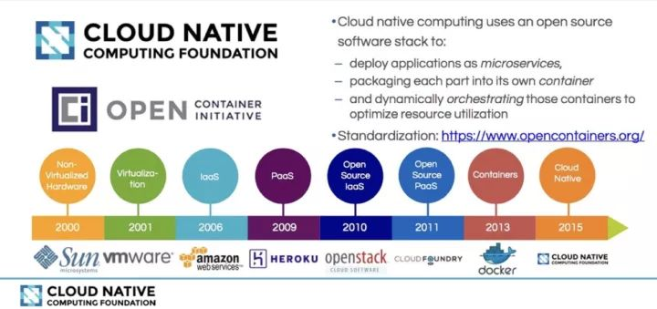
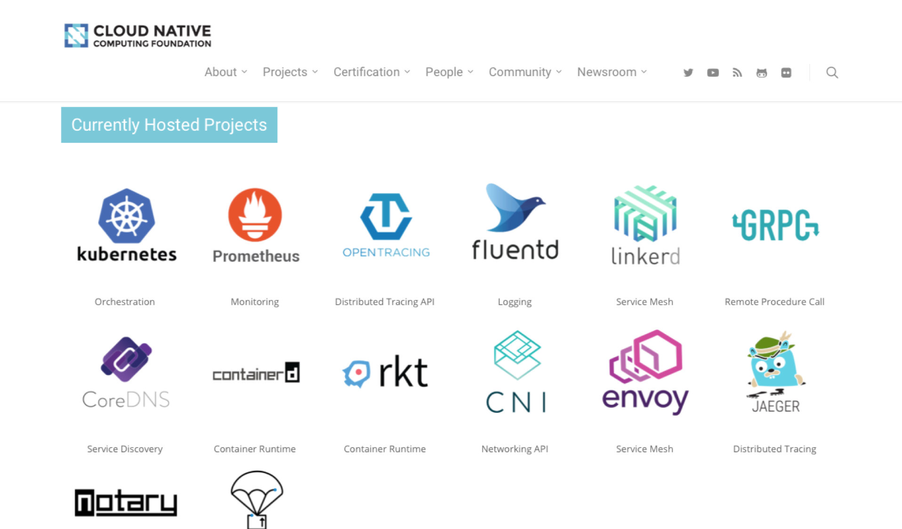
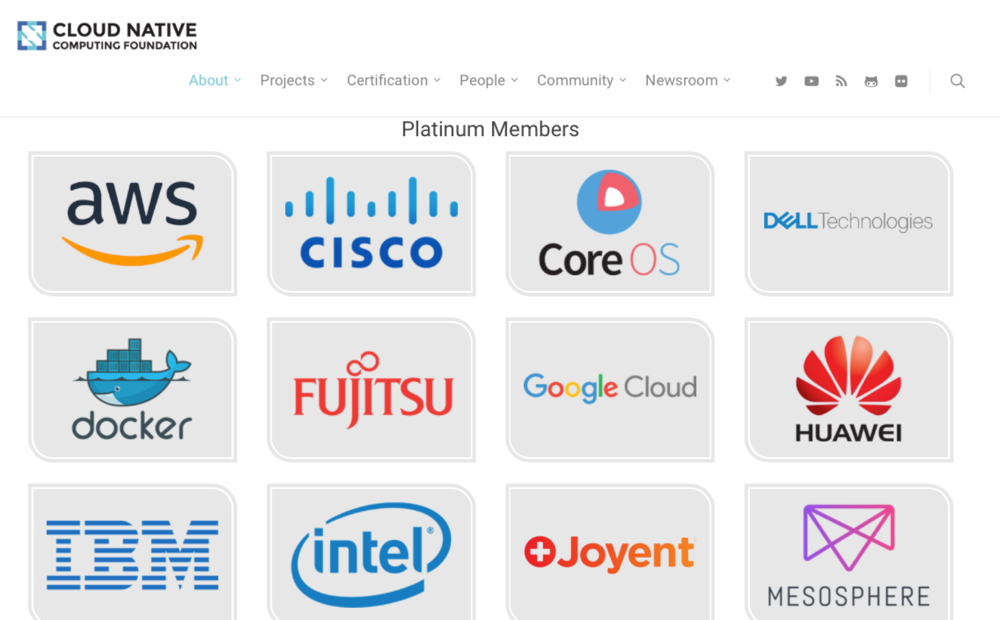

##云原生应用
```
CNCF官网
    https://www.cncf.io/projects
github
    https://github.com/cncf  
  
```
###云原生应用（CloudNative产生的要素）
```
云原生应用包含的面非常广大，这是整个IT行业发展的必然结果。其主要的演进因素如下：
1.硬件资源的演进，
   内存从远古时代几KB，逐步向大容量高速容错内存方向发展
   CPU从单核心，单线程，逐步向多喝些，多线程，高频次，搞速度计算发展
   磁盘从几MB逐步向着，多磁盘阵列，大容量，超大容量方向发展，为加速磁盘访问速度有紧急SSD 
2.操作系统的演进
   无论是windows，macOS,XLinux等系统都在快速发展，特别是Xliuxn系统的发展直接催生了诸如
   docker，rkt等容器技术。如果没有操作系统的演进和发展，没有底层的OS在处理能力，访问能力
   管理能力，监控能力上的多方面显著提升，就不会有cloudNative的出现。
3.云计算的演进
   为了能实现资源高效分配，资源深度隔离，资源灵活调度，云计算的发展形态在硬件资源（存储、网络、计算）
   等方面催生了IaaS（Infrastructure as a Service），即基础设施即服务.
   在托管的OS和systemApp方面催生了PaaS(Platform as a Service)，即平台即服务.
   在应用系统的userApp方面催生了SaaS(Software as a Service)，即软件即服务.
   当然IaaS,PaaS,SaaS早已经不是什么新鲜的概念，我们可以将这组云计算归结为传统云计算。
   随着docker的大红大紫，容器技术流行起来，许多创新性云计算公司提出了CaaS(Container as a Service),
   即容器即服务.DaaS(Data as a service),即数据即服务.BDaaS(BigData as a service),即大数据即服务.
   SpaaS(Spark as a service),即Spark即服务. HaaS(Hadoop as a service),即Hadoop即服务. 
   BaaS(Backend as a service),即后端即服务. CLaaS(Cluster as a service),即集群即服务.
   KaaS(Kubernetes as a service),即kubernetes即服务.MaaS(Mesos as a service),即mesos即服务.
   等等等等，各种Xaas.
4.应用的演进
   应用的演进精力了MonolithApplication(巨石应用)，N-tier(分层应用)， SOA-DistributedApplication(SOA
   分布式应用)，MicroService-DistributedApplication(微服务分布式应用)，ServiceMesh-DistributedApplication
   (服务网格分布式应用)等主流演进趋势。同时为了更加轻量级，更加灵活，更加敏捷，更加高效能演进出了FaaS(功能即服务)。    
5.管理理论的演进
   软件开发的管理理论，经历了规中矩的瀑布模型（Waterfall Model），敏捷开发（agile development），
   DevOps(Development&Operations)等一整套的软件开发管理。为了满足不断发展的形式的需要特别是互联网企业的
   快速试错，小步快跑，持续迭代的开发实际需要，这些理论还在不断深化内涵，扩大外延，强化核心。
6.工具链的演进
   整个cloudNative所需的工具链，都在快速发展。前后端的IDE[Integrated Development Environment]（webstorm，
   idea，eclipse,Visual Studio, sublime等）,软件依赖工具(maven,sbt,npm等)，CVS[Concurrent Version 
   System](git,svn等)，软件测试工具（Junit，Selenium等），持续集成工具（Jenkins，Travis CI,hudson,TeamCity等），
   容器技术（docker，rkt等），容器编排工具（kubernetes,mesos,docker-swarm等）
   在软件开发工程中不同方面，不同阶段，不同层次上的整个工具链都在快速发展，更快的催生出了云原生应用。
7.编程范式的演进
   前端从最简单的css,html,javascript演进到mvvm,mvp，jsNative，nodejs等，更提出了大前端的概念。
   后端以Java为例，从单Tomcat+app到springMVC时代到SprintBoot再到SpringCloud。
   各个语言为了适应开发形式的需要，都在语言规范，框架约定，最佳实践，快速发展。
8.总之，一切为了适应时代的发展，一切为了引领时代的发展，整个IT体系在各个角落向着人们期望的样子发展。CloudNative就
   应运而生了。CloudNative不是软件发展的终点，它只是一个里程碑，一方面它代表着所有软件发展成果的最佳结晶，另一方面
   它启迪着更加美好的未来。      
```
###云原生应用包含的方面
```
云原生应用不是一个具体的概念，不是一项具体的技术，不是一个具体的事物。它的核心定义不好给出，只能给出它所包含的方面，当然
它所包含的方面，正式催生它产生的要素。
    1.它包含传统云计算发展的全部成果（iaas，paas,saas）,只是是不排斥云计算的，这是云云原生的核心基础。
    2.它包含了代表应用实践过程中的最好成果--微服务（microservie）,因为没有微服务就谈不上敏捷和云原生。
    3.它包含了devops的管理理论，并融合支持整个devops的工具链条。
    4.它包含了前端和后端的微服务框架，前端诸如（vue,angular,react等，后端诸如（springboot,springcloud等）
    5.它包含了容器（docker是是实施标准）及容器服务的编排系统（kubernetes,mesos,swarm等）
    6.它包含了一切帮助开发者上云的各种要素，按人们的希望来规整自己的服务。
```
###云原生的发展历程
下图很好的展示了云原生应用的发展历程，也更清晰的展现着云原生的发展趋势。


###云原生主要包含的项目

###云原生主要参与企业


